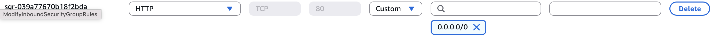

# nodejs-terraform

Builds, publishes to ECR, and deploys a Node.js application to ECS using GitHub Actions.

## Login to AWS with access key and secret

```
aws configure
```

## Add GitHub secrets

Copy your AWS access key, secret, and default region (eu-west-2) to the GitHub secrets at:
Secrets and variables -> Actions -> Repository secrets

```
AWS_ACCESS_KEY_ID
AWS_DEFAULT_REGION
AWS_SECRET_ACCESS_KEY
```

##  Create an S3 bucket for Terraform state storage

```
aws s3api create-bucket  \
  --bucket dbrown-terraform-state-bucket \
  --create-bucket-configuration LocationConstraint=eu-west-2

aws s3api put-bucket-versioning \
  --bucket dbrown-terraform-state-bucket \
  --versioning-configuration Status=Enabled

aws s3api put-bucket-encryption \
  --bucket dbrown-terraform-state-bucket \
  --server-side-encryption-configuration '{
    "Rules": [{
      "ApplyServerSideEncryptionByDefault": {
        "SSEAlgorithm": "AES256"
      }
    }]
  }'
```

## Create a private ECR instance to store the Docker images

Create a private ECR repository at https://eu-west-2.console.aws.amazon.com/ecr/private-registry/repositories/create?region=eu-west-2

Copy the ECR registry and repository from the UI to the "Build, tag, and push Docker image to Amazon ECR" step in /.github/workflows/deploy.yaml

```
- name: Build, tag, and push Docker image to Amazon ECR
  env:
    ECR_REGISTRY: 746867312608.dkr.ecr.eu-west-2.amazonaws.com
    ECR_REPOSITORY: nodejs-terraform
    IMAGE_TAG: latest
  run: |
    docker build -t $ECR_REGISTRY/$ECR_REPOSITORY:$IMAGE_TAG .
    docker push $ECR_REGISTRY/$ECR_REPOSITORY:$IMAGE_TAG
```

Also configure the ECR URI in the "aws_ecs_task_definition" entry at /terraform/main.tf

```
container_definitions = jsonencode([
    {
      name = var.app_name
      image = "123456789.dkr.ecr.eu-west-2.amazonaws.com/nodejs-terraform:latest"
      ...
    }
  ])
```

## Region configuration

The region (e.g. eu-west-2) should be configured in all /terraform/* files.

## Terraform configuration

Use your pre-existing AWS security group, VPC and subnets for the specified region.

Configure these in /terraform/terraform.tfvars

## Open Issues

1. The application does not load at the load balancer URL.
Add a new inbound rule type of HTTP, source Anywhere-IPv4 so the public load balancer URL works.



## Source

https://medium.com/@pavankalyanmeda5779/deploying-a-node-js-app-on-aws-ecs-fargate-with-terraform-and-github-actions-b6463d4a07fe